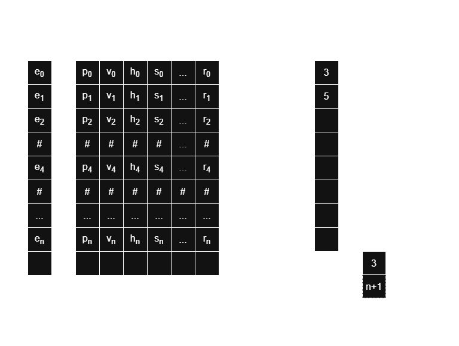
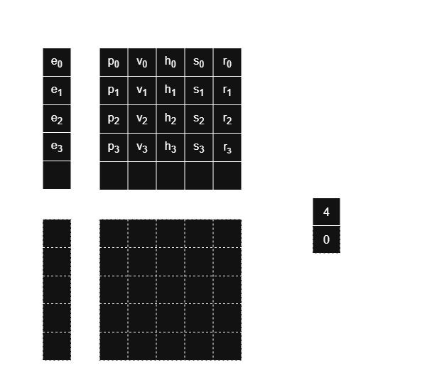

**moecs** - easy to use entity component system (ecs) crafted with odin.

---

[Setup](#setup)\
[Worlds](#worlds)\
[Elements](#elements)\
[Mutability and deferred actions](#mutability-and-deferred-actions)\
[Resources](#resources)\
[Entities](#entities)\
[Components](#components)\
[Tags](#tags)\
[Systems](#systems)\
[Observers](#observers)\
[Running the world](#running-the-world)\
[Iterating entities](#iterating-entities)\
[Performance](#performance)\
[Made with moecs](#made-with-moecs)\
[Memory concept](#memory-concept)

### Setup
Clone moecs repository into your project or nearby and import `src` folder.
```odin
import ecs "moecs/src"

main :: proc() { /* ... */ }
```

### Worlds
The top container is the space (ecs) that consists of worlds. You can create as much worlds as you want and all of them will be proceeded separately. But as a rule, one world is enough for you.
```odin
import ecs "moecs/src"

main :: proc() {
  /* Initializes the space (ecs). */
  ecs.init()
  /* Creates new world. */
  world : ^ecs.World = ecs.new_world()
  /* Destroy all objects and free memory. */
  ecs.destroy()
}
```
| Procedure      | Description                                                                                  |
|----------------|----------------------------------------------------------------------------------------------|
| init()         | Initializes the ecs. Call it before all other actions with ecs.                              |
| size()         | Gets worlds count.                                                                           |
| new_world()    | Creates new world and returns a pointer to it.                                               |
| destroy()      | Free all worlds of the space. Call it before app exit or when ecs is not need anymore.       |

### Elements
Kinds of elements that the world can consist of represented with `Element` enum.
| Member         | Description                                                                                  |
|----------------|----------------------------------------------------------------------------------------------|
| COMPONENT      | Component element type (`Position`, `Mass`, `Velocity`). Must be defined as a struct or distinct custom type.                                                                                                  |
| TAG            | Tag element type for marking entities with some kind of characteristic. Must be defined as a `typedef` with a simple fundamental underlying type (`typedef Tag = int`).                                     |
| RESOURCE       | Resource element type for storing data in the world that has only one instance, singleton. Must be defined as a struct or `typedef` custom type. Resources are not entities without components as in other ECS, they have own storage and methods.                                                                            |
| SYSTEM         | System element type for running actions at each step of the world progress.                  |

You must register world elements before running the world.
```odin
import ecs "moecs/src"

main :: proc() {
  ecs.init()
  world := ecs.new_world()

  /* Register components */
  ecs.register(world, .COMPONENT, Position)
  ecs.register(world, .COMPONENT, Rotation)
  /* Register resources. */
  ecs.register(world, .RESOURCE, GameState)
  ecs.register(world, .RESOURCE, Sprites)
  /* Register tags. */
  ecs.register(world, .TAG, Player)
  ecs.register(world, .TAG, Asteroid)

  ecs.destroy()
}

```
| Procedure      | Description                                                                                  |
|----------------|----------------------------------------------------------------------------------------------|
| register()     | Registers element type for the world.                                                        |

### Mutability and deferred actions
There are methods for getting resources and components: `get()` and `get_mut()`. Use `get_mut()` only if you need to modify at least one instance of receiving resource/component types, otherwise use `get()` - it is little bit faster. Also use overloaded procedures to get a bunch of elements by one procedure call, the same is true for setting values with `set()` procedure. Bunch methods gives you more performance because use less memory read/write operations.\
\
When you `despawn` entities, these actions will be deferred. We need to keep entities in the archetypes till end of the current progress step, otherwise iterators inside systems code can lead to bugs, as they iterate over collections of the archetypes which we need to delete entities from. Entities will be marked as `DESPAWNING` but despawned (deleted from the block) at performing stage. Also, a new entity can be written in place of a deleted entity, then bugs are inevitable since the reference to the deleted entity will continue to be stored in the archetype collection.\
\
If you set observers for despawning entities, callbacks will also be deferred to the performing stage until the actual moment of despawning.\
\
When you `add`/`remove` a component, or `set`/`unset` a tag they will still present in current archetypes till end of the current progress step. When `tags`/`components` is being `added`/`removed` to the entity and world is already running, entities should not be moved to other archetypes till end of the current progress step, so this archetyping action is deferred to the perform stage.\
\
This means that changes will will be applied only at the next world progress step.\
But **setting values to resource/components is being applied immediately** (is not deferred).

### Resources
Resources are data structures that you only need one instance of and represent game state, sprites (textures), physics parameters, etc. You need to `register` their types and `set` their values before `getting` them. You can add a number of resources that is less or equals `MAX_RESOURCES_COUNT`, if you need more, please, change this constant manually. You must `run` the world before setting values to resources.
```odin
import ecs "moecs/src"
import b2 "vendor:box2d"

main :: proc() {
  ecs.init()
  world := ecs.new_world()

  /* ...register resource types. */

  /* You should run the world before filling it with elements. */
  ecs.run(world)

  /* Sets resource value (will be copied into storage). */
  ecs.set(world, GameState, &GameState {
    screen     = .Playing,
    fullscreen = false,
    zoom       = 1.0,
    scaled     = time.now()
	})

  /* Gets resource values (making a copy from storage). */
  state, sprites := ecs.get(world, GameState, Sprites)
  /* Gets pointer to resource value (mutable). */
  physics := ecs.get_mut(world, Physics)

  world_def := b2.DefaultWorldDef()
  world_def.gravity = { 0.0, 0.0 }
  /* Mutating resource value (by pointer/in place). */
  physics.world_id = b2.CreateWorld(world_def)

  ecs.destroy()
}
```
| Procedure          | Description                                                                              |
|--------------------|------------------------------------------------------------------------------------------|
| set_resource()     | Sets **one** resource value by its type.                                                 |
| get_resource()     | Gets **one** resource value by its type.                                                 |
| get_resource_mut() | Gets reference (pointer) to **one** resource value by its type.                          |
| set()              | Sets a bunch of resource values (*recommended*).                                         |
| get()              | Gets a bunch of resource values (*recommended*).                                         |
| get_mut()          | Gets a bunch of pointers to resources for changing resource fields (*recommended*).      |

### Entities
Entities are the main elements of the world. It is the abstract data structure that can be specified by components and tags. Entity is not just an id and has some fields, but you should not care about them and use procedures to work with it. Internally there are bit-set fields which define what components and/or tags the entity has. Thus, when deleting a component and adding/removing a tag, reading/writing to memory does not occur.\
\
When you despawn an entity this action is deferred to the end of the current progress step, so if you want to omit such entities in the current progress step (game frame) use `despawning` procedure to check that state. Also you may want to check that entity is really despawned if you have a pointer to it from previous progress steps, then use `deleted` procedure.\
\
All entities have a lifetime (`.DYNAMIC` or `.STATIC`). But you'll not find this data in the entity itself, it is only defined in the memory block the entity belongs to and once entity was spawned its lifetime can't be changed.
```odin
import ecs "moecs/src"

main :: proc() {
  ecs.init()
  world := ecs.new_world()
  ecs.run(world)

  /* Spawns static entity. */
  asteroid: ^ecs.Entity = ecs.spawn(world, .STATIC)
  /* Spawns dynamic entity (.DYNAMIC lifetime is default). */
  ship := ecs.spawn(world)

  ecs.destroy()
}
```
| Procedure          | Description                                                                              |
|--------------------|------------------------------------------------------------------------------------------|
| spawn()            | Spawns **one** new entity into the world.                                                |
| despawn_entity()   | Despawns **one** entity from the world.                                                  |
| despawn_entities() | Despawns **several** entities from the world.                                            |
| despawn()          | Overloaded procedure for despawning one or several entities (*recommended*).             |
| despawning()       | Checks if the entity is deferred for despawning at the perform stage.                    |
| deleted()          | Checks if the entity has been fully deleted (despawned).                                 |
| is_dynamic()       | Checks if the entity belongs to dynamic lifetime block.                                  |
| is_static()        | Checks if the entity belongs to static lifetime block.                                   |

### Components 
Components are stored in the chunks of a block, internally it is continuous block of memory reading/writing to which is implemented with pointer math. We know entity index, components size and block size (`DYNAMIC_CHUNK_SIZE`, `STATIC_CHUNK_SIZE`), so access by pointer is pretty simple.\
\
Entity may has a number of components that less or equals `MAX_COMPONENTS_COUNT` constant. By default it equals `128` and if you need more, please, change the value of this constant manually.\
\
Component types must be registered before using in the ecs and world should run before you start adding components.\
\
When you add components or set values to previously added components, the changes are stored in the memory immediately and you can read these values at the same world progress step, there are no caching at all. But `adding`/`removing` components defer archetypes re-binding (archetyping) till the `perform` stage, so your systems match queries will consider them only on the next progress step.\
\
The presence of certain components in an entity is determined by bit flags in a special field of the entity structure. Removing a component from an entity does not cause any memory access, but simply sets the corresponding bit. Reading this bit applies to checking for the presence of a component in an entity.\
\
Prefer using overloaded procedures to `add`/`set`/`get` a bunch of components by one procedure call. Bunch methods gives you more performance because use less memory read/write operations.
```odin
import ecs "moecs/src"

main :: proc() {
  ecs.init()
  world := ecs.new_world()
  /* ...register component types here. */
  ecs.run(world)

  ship := ecs.spawn(world)

  /* Adds components to the entity. */
  ecs.add(ship,
    Position, &Position { x = 350, y = 170 },
    Rotation, &Rotation { angle = 90 },
    Velocity, &Velocity { 50 },
    Weapon,   &Weapon   { kind = .Rocket })

  /* Getting one component (mutable method). */
  if weapon, ok := ecs.get_mut(ship, Weapon); ok {
    weapon.kind = .Bullet
  }

  /* Setting values of previously added components. */
  ecs.set(ship,
    Position, &Position { x = 700, y = 900 },
    Rotation, &Rotation { angle = 180 })

  /* Getting several compoents (for reading, making a copy from storage). */
  pos, rot := ecs.get(ship, Position, Rotation)
  /* Getting pointers to component values (mutable method). */
  vel, weapon := ecs.get_mut(ship, Velocity, Weapon)

  /* Removes components from the entity. */
  ecs.remove(ship, Position, Rotation)

  /* Checks if the entity has a component. */
  if ecs.has(ship, Position) {
    ecs.set(ship, Position, &Position { x = 0, y = 0 })
  }

  ecs.destroy()
}
```
| Procedure          | Description                                                                              |
|--------------------|------------------------------------------------------------------------------------------|
| add_component()    | Adds **one** component to the entity by type and instance (initializer).                 |
| set_component()    | Sets **one** previously added component value.                                           |
| get_component()    | Gets **one** component value by its type (copy from storage).                            |
| get_component_mut()| Gets reference to **one** component value by its type.                                   |
| remove_component() | Removes **one** component from entity by its type.                                       |
| remove_components()| Removes **several** components from entity of all passed types.                          |
| has_component()    | Checks if the entity has a component.                                                    |
| has_components()   | Checks if the entity has all components of passed types.                                 |
| add()              | Adds a bunch of components (*recommended*).                                              |
| set()              | Sets a bunch of components (*recommended*).                                              |
| get()              | Gets a bunch of components (*recommended*).                                              |
| get_mut()          | Gets a bunch of pointers to components for changing its values (*recommended*).          |
| remove()           | Removes any number of components by their types (*recommended*).                         |
| has()              | Checks for presence of any number of components by their types (*recommended*).          |

### Tags
Tags are just attributes (signs) that can be `set`/`unset` for entities. Just like components, an entity has a special bit field, in which each bit corresponds to a tag. However, unlike components, tags are not stored in memory chunks. Adding/removing a tag simply means setting the corresponding bit in the entity field.\
\
Entity may has a number of tags that less or equals `MAX_TAGS_COUNT` constant. By default it equals `128` and if you need more, please, change the value of this constant manually. Tags types must be registered before adding to entities.\
\
Settings/unsetting tags defer entity archetypes re-binding (archetyping) till the `perform` stage, so your systems match queries will consider these tags changes only on the next progress step.
```odin
import ecs "moecs/src"

main :: proc() {
  ecs.init()
  world := ecs.new_world()
  /* ...register tags and components types here. */
  ecs.run(world)

  entity := ecs.spawn(world)
  /* Tags entity as a Player. */
  ecs.tag(entity, Player)

  entity = ecs.spawn(world)
  /* Tags entity as a Ship that is sleeping. */
  ecs.tag(entity, Ship, Sleep)

  /* Iterate through all the entities in the world. */
	ecs.each(world, callback = proc(entity: ^ecs.Entity, lifetime: ecs.Lifetime, world: ^ecs.World) {
    /* Checks if entity has Player tag. */
    if ecs.tagged(entity, Player) {
      ecs.add(entity, Actions, &Actions {})
    } else {
      /* Remove tag from entity (unset corresponding bit). */
      ecs.untag(entity, Sleep)
    }
  })

  ecs.destroy()
}
```
| Procedure          | Description                                                                              |
|--------------------|------------------------------------------------------------------------------------------|
| set_tag()          | Tags entity with **one** specified tag type.                                             |
| set_tags()         | Tags entity with **several** passed tag types.                                           |
| unset_tag()        | Removes **one** tag from entity (unset corresponding bit in entity's marker field).      |
| unset_tags()       | Removes **several** tags from entity of all passed types.                                |
| has_tag()          | Checks if the entity is tagged with specified tag type.                                  |
| has_tags()         | Checks if the entity is tagged with all passed tag types.                                |
| tag()              | Tags entity with a bunch of tag types (*recommended*).                                   |
| untag()            | Removes a bunch of tags from the entity (*recommended*).                                 |
| tagged()           | Checks if the entity is tagged with a bunch of tag types (*recommended*).                |

### Systems
Systems are place where your game/app algorithms are living, processing user input, drawing, physics, collisions, effects, entities behavior and anything else can be split into separate systems. They are being ran in the order they were mounted to the world for each phase in the progress pipeline.
| Phase              | Description                                                                              |
|--------------------|------------------------------------------------------------------------------------------|
| START              | System will run once at the beginning of the first progress step.                        |
| PRE_UPDATE         | System will run before update phase.                                                     |
| UPDATE             | Main phase of each progress step.                                                        |
| POST_UPDATE        | System will run after update phase.                                                      |
| MANUAL             | System can be executed only manually using its name, excluded from progress pipeline.    |

Internally systems are represented by structs with all necessary configuration inside. There is `SystemCallback` procedure type that will be called for each system at each world progress step. When you define your system procedure you must follow `SystemCallback` signature, where first parameter is a pointer to dynamic array of pointers to matched entities and second one id pointer to the world.\
\
You pass a list of component types and/or tag types when mounting a system and these set is a match query for selection of entities which will be passed to system callback. Entity *must have* all components and tags defined for the system to match its query condition (but it also may have more, it *hasn't to be exact match*). If you need to exclude entities without some components/tags from the query result (entities *mustn't have them added*), you can use `without` condition when mount the system. If system has no specified components/tags and `without` conditions it is considered as a task, no queries are executed for them at each progress step, and `nil` is passed as first argument of callback procedure (instead of matched entities array).\
\
There are two query match approaches of selection entities for the systems.
| Approach           | Description                                                                              |
|--------------------|------------------------------------------------------------------------------------------|
| ITERATION          | Using this approach at each progress step all world entities will be iterated with applying match conditions to select them for each running system. First, iterates through all entities in the world for which the match condition is checked, and if the entity matches, it is added to the system's collection of entities. Then, all systems to which the generated collections are passed are executed in turn. At the beginning of progress each step, these collections are cleared. This is a very *inefficient* approach, but it does not involve deferred actions.                                                                                     |
| ARCHETYPE          | Each entity belongs to some unique archetype that is combination of bit flags that represent entity's components/tags configuration. At each world progress step all archetypes will be iterated with applying match condition of each system. If an archetype matches the system query conditions, the system is launched with a list of entities of that archetype. This is an *efficient* approach, but it requires deferred actions. The system callback will be invoked for each matching archetype. *Recommended approach*.                                 |

You can give the system a `name` to have ability to `get`/`execute`/`enable`/`disable` it manually, but name is just a property, systems with name run in pipeline exactly same way as without it. To exclude system from pipeline its `phase` must be set to `MANUAL`. Disabled systems are not called and no queries are executed for them at each progress step till they will be enabled again.\
\
When you mount a system only `callback` parameter is mandatory, in this case system will be a *task* and run in `UPDATE` phase. These are all parameters of `mount` procedure you can use when mounting a system.
| Parameter          | Description                                                                              |
|--------------------|------------------------------------------------------------------------------------------|
| world              | Pointer to the world (used in almost all ecs procedures).                                |
| name               | Name of the system. It must be unique. Used for getting the system from the world.       |
| query              | Components and tags list that should match while the system query. You can also separate types using `components` and `tags` parameters of `mount` procedure. Using both approaches simultaneously, or crossing or duplicating types in different params is safe.                                                    |
| components         | Components list that should match while the system query.                                |
| tags               | Tags list that should match while the system query.                                      |
| without            | Components and tags list that should not be added to the entity, so system query will match entities only without them, even if these components and tags were included into main query list.             |
| phase              | System running phase, order in the pipeline. By default equals UPDATE.                   |
| lifetime           | Entities lifetime flag to optimize queries and do not process lifetimes that you want to avoid for current system. Not used in ARCHETYPE approach.                                                     |
| callback           | Callback function that will be invoked each step of the world progress.                  |

You can mount systems *only when* the world is already running, because of necessary indexes sorting made in `run` procedure of the world.
```odin
import ecs "moecs/src"
import k2 "karl2d"

main :: proc() {
  ecs.init()
  /* You can pass approach here, default is .ARCHETYPE, recommended. */
  world := ecs.new_world(.ARCHETYPE)
  /* We must mount systems after the world run. */
  ecs.run(world)

  /* Mount system that will run only once after world starts. */
  ecs.mount(world, callback = load_world,     phase = .START)
  /* Mount systems which will run in .UPDATE phase (default). */
  ecs.mount(world, callback = actions,        components = { Handle, Actions, Weapon, Ship }, tags = { Player })
  ecs.mount(world, callback = physics,        name = "physics")
  /* You can use query or/and components and tags fields to define system query (list of components and tags). */
  ecs.mount(world, callback = draw,           query = { Position, Rotation, Sprite, Center, Size })
  ecs.mount(world, callback = collisions,     components = { Collision, Handle, Position, Center })
  /* Use without condition to exclude listed components/tags from system query result. */
  ecs.mount(world, callback = materialize,    query = { Position, Rotation }, without = { Handle, Player })
  /* Mount systems to run them manually (phase = .MANUAL). */
  ecs.mount(world, callback = load_resources, name = "load-resources", phase = .MANUAL)
  ecs.mount(world, callback = destroy,        name = "destroy", phase = .MANUAL)

  /* Execule system by its name. */
  ecs.execute(world, "load-resources")

  for k2.update() {
    k2.clear(k2.BLACK)
    /* World progress step. Systems run in mounting order for each phase
       in phases order: PRE_UPDATE, UPDATE, POST_UPDATE. */
    ecs.progress(world)
    k2.present()

    /* Turn off/on physics processing. */
    if condition() do ecs.disable(world, "physics")
    else do ecs.enable(world, "physics")
  }

  /* You can unmount the system this way even if the world is already running.
     Maybe you know that do not need it any more, but disabling is recommended. */
  if ecs.has(world, "physics") do ecs.unmount(world, "physics")
  
  /* Manually free all game resources in this system. */
  ecs.execute(world, "destroy")
  ecs.destroy()

  k2.shutdown()
}
```
| Procedure          | Description                                                                              |
|--------------------|------------------------------------------------------------------------------------------|
| mount()            | Mounts new system to the world.                                                          |
| unmount()          | Unmounts the system from the world.                                                      |
| has_system()       | Checks if system with specific name was mounted.                                         |
| get_system()       | Gets reference to the system by its name.                                                |
| has()              | Overloaded procedure for checking system existence (*recommended*).                      |
| get()              | Overloaded procedure for getting system (*recommended*).                                 |
| execute()          | Execute system by its name.                                                              |
| enabled()          | Checks if the system is enabled.                                                         |
| enable()           | Enables the system.                                                                      |
| disable()          | Disables the system.                                                                     |

### Observers
Observers are a mechanism that allows to subscribe on events of structural and data changes in the world. By default observers are disable for performance reasons, so you need to pass `true` for `observable` argument of `new_world` procedure when you create the world. You also can change `observable` property of the world to turn off/on observers globally.\
\
There are different event types that can be handled for entities, components, and tags.
| Event              | Description                                                                              |
|--------------------|------------------------------------------------------------------------------------------|
| SPAWNED            | Entity has been spawned.                                                                 |
| DESPAWNED          | Entity has been despawned.                                                               |
| ADDED              | Component has been added to an entity.                                                   |
| REMOVED            | Component has been removed from an entity.                                               |
| SET                | Component value has been set (changed).                                                  |
| TAGGED             | Tag has been added to an entity.                                                         |
| UNTAGGED           | Tag has been removed from an entity.                                                     |

Keep in mind that when you add/remove a component repeatedly or set/unset a tag repeatedly, the events will also be fired repeatedly for each operation even if you already made it before. It is safe for the data to call `add_component` (for example) procedure several times and pass the same component type to it, but your observers logic can be broken, so you need care about it yourself.\
\
You can turn on/off observers for a specific component/tag type or globally for an event type. You can also check whether an observer is set or turned on. Events are not supported for resources.\
\
When you set an observer using `observe` you must provide callback procedure that should follow `ObserverCallback` procedure type. `SPAWNED`/`DESPAWNED` events are being thrown for all entities and there are nothing to pass for `type` and `component` parameters, so the will be `nil` for these events in callback. Pointer to event target entity will be passed as `entity` parameter to callback. For `TAGGED`/`UNTAGGED` events tag type will be passed as `type` parameter, but `component` will be equals to `nil`. And finally for `ADDED`/`REMOVED`/`SET` events all callback parameters will be set, and `component` parameter is a pointer to event target component value, you can safety change it's value in place or read it, previously cast `rawptr` to expecting component type pointer.\
\
When you provide several `types` in `observe`/`unobserve` procedures the same callback will be assigned as specific event handler for each of these `types`. This is done for convenience, there are no group observers, they are set separately for a specific event and element (component/tag) type.\
\
You must set observers *only when* the world is already running, because of necessary indexes sorting made in `run` procedure of the world. Subsequent setting observers for some configuration will replace previous ones.
```odin
import ecs "moecs/src"

/* Observer callback procedure declaration. */
added :: proc(world: ^ecs.World, entity: ^ecs.Entity, event: ecs.Event, type: typeid, component: rawptr) {
  switch type {
    case Position:
      pos := cast(^Position)component
      /* Do not use observers for such purposes, it's just example. */
      pos.x += 50
      pos.y += 50

    case Center:
      center := cast(^Center)component
      /* Component values will be safety changed in place. */
      center.cx += 50
      center.cy += 50
  }
}

main :: proc() {
  ecs.init()
  /* Enable observers when create the world. */
  world := ecs.new_world(observable = true)
  /* ...register tags and components types here. */
  ecs.run(world)

  /* Set observers for entity spawning/despawning, you need to provide only callbacks. */
  ecs.observe(world, event = .SPAWNED, callback = spawned)
  ecs.observe(world, event = .DESPAWNED, callback = despawned)
  /* You can set observers for one or several types, subsequent assignments replace previous ones. */
  ecs.observe(world, event = .ADDED, types = { Rotation }, callback = added_rot)
  ecs.observe(world, event = .ADDED, types = { Position, Center, Health, Velocity }, callback = added)
  ecs.observe(world, event = .REMOVED, types = { Center, Position }, callback = removed)
  ecs.observe(world, event = .SET, types = { Position }, callback = set_pos)
  ecs.observe(world, event = .SET, types = { Center, Rotation, Health, Velocity }, callback = set)
  ecs.observe(world, event = .TAGGED, types = { Ship, Asteroid }, callback = tagged)
  ecs.observe(world, event = .UNTAGGED, types = { Ship, Asteroid }, callback = untagged)

  /* Turn off all added events for all component types. */
  ecs.turn_off(world, .ADDED)
  /* Turn off added events for Velocity component type. */
  ecs.turn_off(world, .ADDED, Velocity)

  if ecs.observable(world, .SET, Position) {
    /* Remove observer for set event of Position component type. */
    ecs.unobserve(world, .SET, { Position })
  }

  /* Turn on all added events for all component types.
     It is still turned off for Velocity component type. */
  if !ecs.turned_on(world, .ADDED) do ecs.turn_on(world, .ADDED)

  ecs.destroy()
}
```
| Procedure          | Description                                                                              |
|--------------------|------------------------------------------------------------------------------------------|
| observe            | Sets observer for specified event and type(s).                                           |
| unobserve          | Unsets observer for specified event and type(s).                                         |
| observable         | Checks if observer is set for specific event and type.                                   |
| turn_on            | Turn on observer for specific event and type.                                            |
| turn_off           | Turn off observer for specific event and type.                                           |
| turned_on          | Checks if the observer for specific event and type is turned on.                         |

Do not enable and use observers unless absolutely necessary. Only do so if something can't be done using systems, as observers are very inefficient and reduce the speed of the ECS. For example, if you're developing a library that utilizes the ECS and initializes and runs the game's physics under the hood using specific components. You need to track the addition and modification of these components to make the appropriate changes to the physics engine. In this case observers are really necessary, for game/app logic use systems, it's much more efficient.

### Running the world
After you `init` the ecs, create the `world`(s), `register` all resources, components, and tags, you have to call `run` for your world(s). This procedure checks all necessary conditions and makes adjustments required for working with the declared world, allocates memory for resources. So, first you define the world, describe it, and then you run it, so you can mount systems, set observers, fill the world with resources, entities, components and execute systems.\
\
You game/app will have main loop where you have to call `progress` procedure for the world. I have called it *world progress step* before, this method runs all systems for all phases. Archetyping and despawning actions is deferred to the end of progress step, when `perform` procedure is called. You also can call it manually, but there should be no reasons to do it. It's very rare that changes can't wait until the next step/frame and calling it manually is inefficient.\
\
Finally (after main loop termination) you can destroy all the world(s) (free memory) calling `destroy` procedure.
```odin
import ecs "moecs/src"

main :: proc() {
  ecs.init()
  world := ecs.new_world()
  /* ...register resources, tags and components types here. */
  ecs.run(world)
  /* ...mount systems here.                                 */
  /* ...set observers here.                                 */

  for loop() {
    ecs.progress(world)
  }
  
  ecs.destroy()
}
```
| Procedure          | Description                                                                              |
|--------------------|------------------------------------------------------------------------------------------|
| run()              | Runs the world, but at first constructs all necessary data from registered elements. World must has at least one registered component, but can has no tags, resources.                                   |
| progress()         | Progress one step of the world life. Runs all mounted systems for all phases.            |
| perform()          | Perform deferred actions for the world.                                                  |

### Iterating entities
Under certain conditions, you may need to iterate over all entities. You pass callback procedure that will be called for each entity that matched passed lifetime (all by default). This could be in a system or for testing purposes. However, don't overuse this procedure, as it's inefficient. It's *not recommended*.
```odin
import ecs "moecs/src"

main :: proc() {
  ecs.init()
  world := ecs.new_world()
  ecs.run(world)

  /* Iterate through all the entities in the world. */
	ecs.each(world, callback = proc(entity: ^ecs.Entity, lifetime: ecs.Lifetime, world: ^ecs.World) {
    pos, center := ecs.get(entity, Position, Center)
    fmt.println(pos, center)
  })

  ecs.destroy()
}
```
| Procedure          | Description                                                                              |
|--------------------|------------------------------------------------------------------------------------------|
| each()             | Step through each entity reference in the world.                                         |

### Performance
I am writing this project in my spare time, just like all my other hobby gamedev. If you want the highest performance, it's best not to use any ECS. I love ECS because it allows you to systematize and separate/parallelize logic/data, move each part of the game into its own system, customize its operation, and generalize logic for entities with different components. As for speed, it will vary on different computers. You can play around with `main.odin`, and see the benchmarks (I use this code for testing). I'd be interested in seeing your results.\
\
Getting (reading) operations executes much faster than setting (writing) ones. Prefer use overloaded `bunch` procedures to process several elements at once, these methods were optimized for performance.\
\
Use `-o:aggressive` Odin compiler flag, it can speed up operations in 30 times.

### Made with moecs
| Game/App           | Description                                                                              |
|--------------------|------------------------------------------------------------------------------------------|
| [mouniverse](https://github.com/helioscout/mouniverse) | Simple space game, I am making in my spare time for fun and learning.                                                                                                 |

### Memory concept
The main idea is that memory for components is divided into blocks, and entities belong to two lifetimes:
- DYNAMIC: usual entities that are spawned and despawned while world exists;
- STATIC: entities that lives forever (same as the world lifetime), like asteroids, planets, buildings;\
\
For DYNAMIC lifetime blocks, components chunks inserted at the end of the block if there are no free rows after previously deleted entities.\
\
\
Because static lifetime entities lives wile the world exists there are no deleting mechanism for them in its blocks, and components are simply inserted to the next free row or new block will be inserted if current one is full.\
\
\
\
There are main constants that you can change when copying ECS into your project if you want to experiment with performance:
- DYNAMIC_CHUNK_SIZE: Dynamic lifetime chunk size;
- STATIC_CHUNK_SIZE: Static lifetime chunk size;\
This constants defines a number of entity records (entity struct and its component chunk) that will be stored in one memory block. When block is full the memory allocation occurs for the next block.\
\
There is no limitations of entities count, but for resource, components, and tags:
- MAX_RESOURCES_COUNT: Maximum resources count available for adding to the world.
- MAX_COMPONENTS_COUNT: Maximum components count available for adding to entity;
- MAX_TAGS_COUNT: Maximum tags count available for adding to entity.
