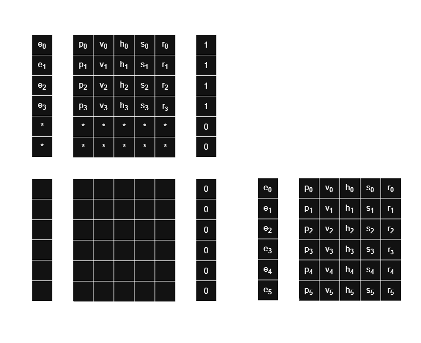

This is my modest attempt at creating an ECS (Entity Component System). The speed didn't meet my expectations, so I temporarily abandoned development, but the system is complete and can be used in small games where the number of entities doesn't exceed hundred of thousands.\
\
The main idea is that memory for components is divided into blocks, and entities belong to three lifetimes:
- QUICK:   entities that lives several frames, like bullets, and require fast memory (stack);
- DYNAMIC: usual entities that are spawned and despawned while world exists;
- STATIC:  entities that lives forever (same as the world lifetime), like asteroids, planets, buildings.\
\
For DYNAMIC lifetime blocks, components chunks inserted at the end of the block if there are no free rows after previously deleted entities.\
\
\
For quick lifetime block entities and components are previously stored in the buffers - arrays of size QUICK_CHUNK_SIZE that are stored on the stack and passed by reference to ECS from main program.\
When buffers are full they will be flushed to newly created block on the heap. The idea is that entities will not outlive the size of quick lifetime block and all access to them should be as fast as stack memory.\
Quick lifetime entities/components blocks does not use mechanism of deleted free rows like dynamics does. If all entities are deleted from the block it is able to absorb data from buffers.\
\
\
\
Because static lifetime entities lives wile the world exists there are no deleting mechanism for its blocks and components are simply inserted to the next free row or new block will be inserted if current one is full.\
\
\

